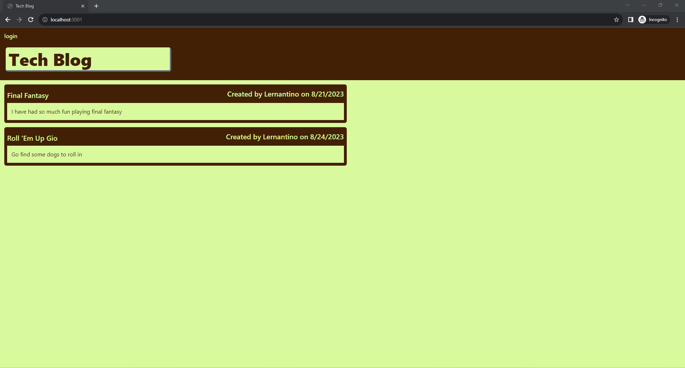
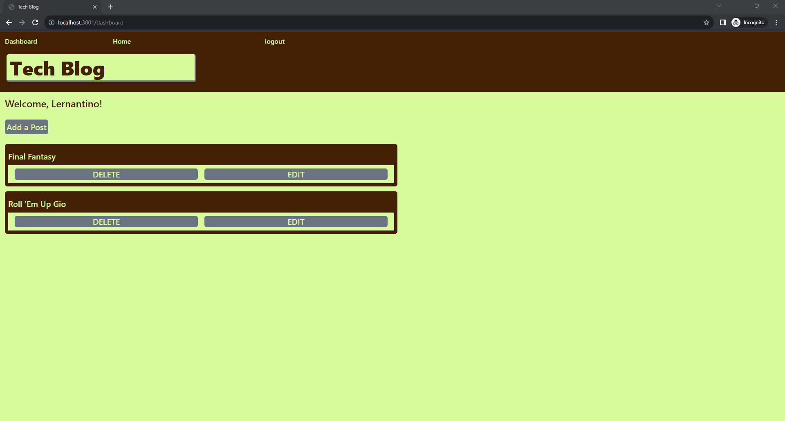
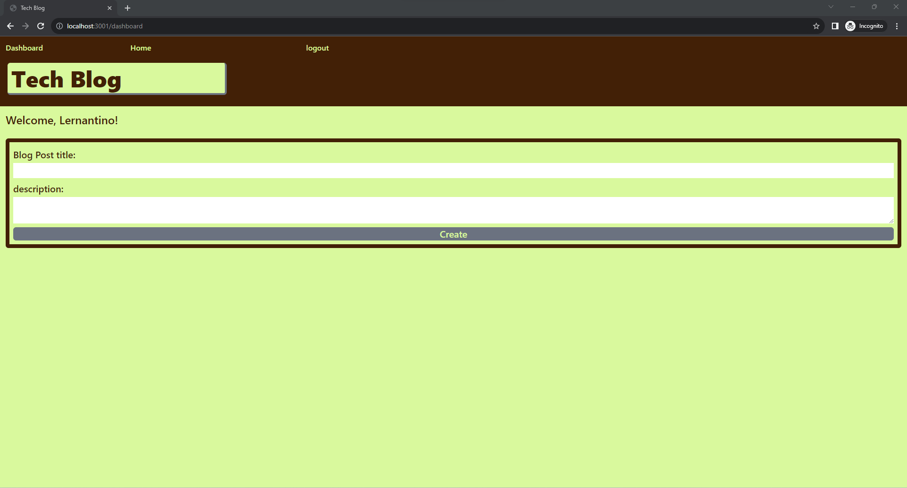

# Online Blog

## Description

Today I have continued to learn more about sequlize and using with handle bars. To demonstrate my skills with sequlize I made a tech blog web application. With the tech blog users will be able to communicate with each other through posts. Posts made can be commented on by others. The appliaction is a way to tell others on something and get feedback from the others. While working on this project I increased my knowledge on query calls, models, and setting up routes with sequlize. I also got some experiance setting up handlebars instead of using many html pages. The component html building.

## Installtion

There are none if your opening the project on the heruko link. Other wise you would just need to install the project libraries through node. Assuming you dont have node you would have to install it on your device. Afterwards you would just type in the following command in the project directory terminal.

    npm intstall

## Usage

To start the project users just have to run the following command.

    npm run start

Right off the bat users should be able to see a web page with a header and a list of tech blogs below the header. If there are no tech blog posts then no posts have been made at all. At this
home page users can click on the blog post and be taken to a page were users can look at comment and make one. To make a comment users have to be loggedin to our web app. 

Once signed in users will be taken to their dashboard where they can make blog posts, edit current blog posts, delete blog posts, and take users to their blog post comment section. Users can go to the home page and click on others blog posts and leave comments. One thing to mention here is that users can mak comments on there own post. Also comments on a blog post can not be deleted unless the whole blog post is deleted.

Users while making a new blog posts there is some validation to make sure some of the feilds are not empty. besides that there is none.

Heroku Link: https://immense-wildwood-60705-8e1ecc7beaca.herokuapp.com

## Credits

Thank you to sequlize and handlebars online documentation. If I ever ran into any issues with a query I go look at the sequlize documentation. The same goes for hanlebars documentation to add ceratin items in the handel bar pages.

Sequlize documentation: https://sequelize.org/docs/v6/core-concepts/model-querying-basics/

Handlebars Documentation:  https://handlebarsjs.com/api-reference/

## License

The project is covered by the MIT license. Please refer to the repo for more information on the license. The link below we will link users to the template followed to make license.

License Link: https://spdx.org/licenses/MIT.html

## Badges

## Questions

Any questions you may have you can contact me through my email shown below and there is a link to my github account.

Email: gvv8106@gmail.com

GitHub Profile: https://github.com/Giovanne-Villanueva